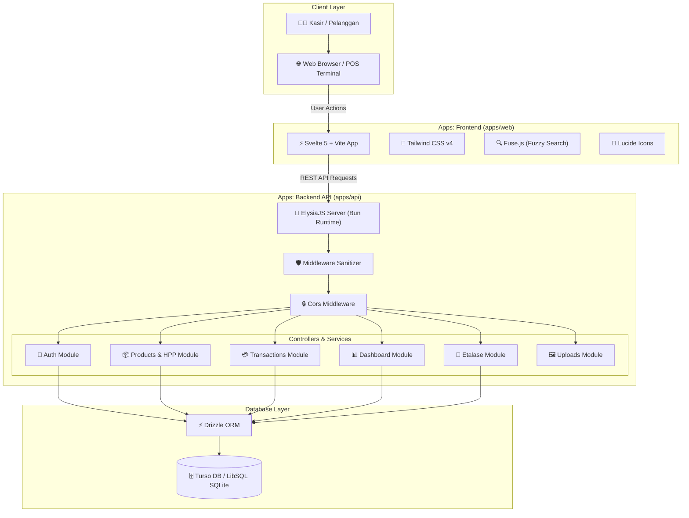
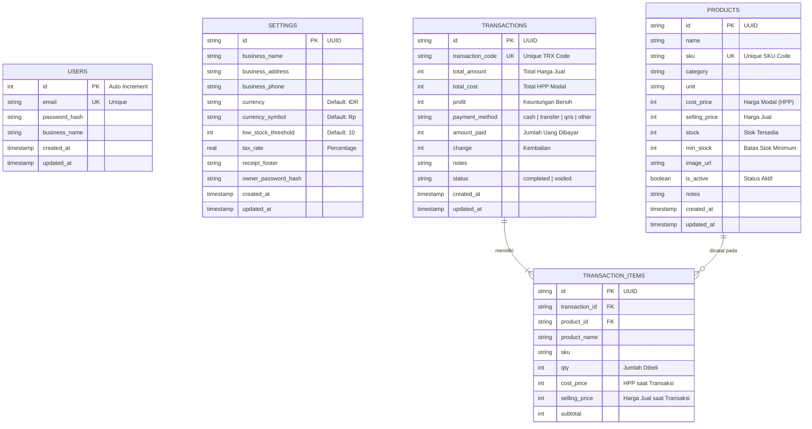
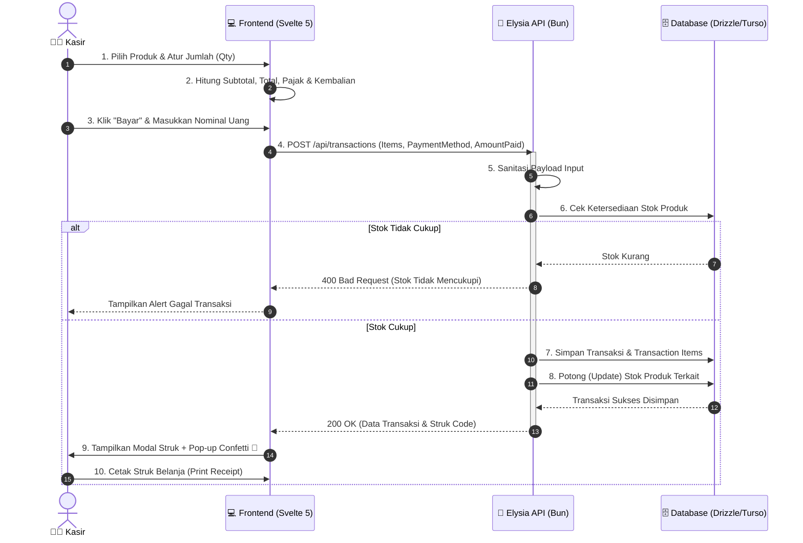

# 🛒 POS (Point of Sale) System — Monorepo

[](https://bun.sh)
[](https://svelte.dev)
[](https://elysiajs.com)
[](https://turbo.build)
[](https://tailwindcss.com)
[](https://orm.drizzle.team)
[](https://turso.tech)

Sistem Kasir (Point of Sale) modern, performan, dan responsif berbasis Monorepo yang dirancang khusus untuk kebutuhan toko retail, usaha mikro, kecil, dan menengah (UMKM), maupun bisnis F&B. Sistem ini menggabungkan frontend web super cepat berbasis Svelte 5 (Runes) dan backend API berkecepatan tinggi berbasis Bun & ElysiaJS.

---

## 📋 Daftar Isi

- [✨ Fitur-Fitur Utama](#-fitur-fitur-utama)
- [🏗️ Arsitektur Sistem & Workflow](#️-arsitektur-sistem--workflow)
  - [1. Diagram Arsitektur Monorepo](#1-diagram-arsitektur-monorepo)
  - [2. Diagram Skema Database (ERD)](#2-diagram-skema-database-erd)
  - [3. Diagram Alur Transaksi Kasir](#3-diagram-alur-transaksi-kasir)
- [💻 Teknologi yang Digunakan](#-teknologi-yang-digunakan)
- [📁 Struktur Monorepo](#-struktur-monorepo)
- [🚀 Panduan Instalasi & Pengoperasian](#-panduan-instalasi--pengoperasian)
  - [Prasyarat](#prasyarat)
  - [Langkah-Langkah Installation](#langkah-langkah-installation)
  - [Konfigurasi Environment (`.env`)](#konfigurasi-environment-env)
- [🛠️ Perintah CLI (Scripts Reference)](#️-perintah-cli-scripts-reference)
- [🔒 Keamanan & Sanitasi Input](#-keamanan--sanitasi-input)
- [🤝 Kontribusi & Lisensi](#-kontribusi--lisensi)

---

## ✨ Fitur-Fitur Utama

### 1. 🖥️ Modul Kasir & Transaksi (Point of Sale)
- **Katalog Interaktif & Pencarian Cepat**: Pencarian produk berbasis judul/SKU dengan pencarian fuzzy instan (*Fuse.js*).
- **Keranjang Belanja Real-Time**: Perhitungan subtotal, jumlah item, kembalian, dan pajak secara otomatis tanpa *delay*.
- **Opsi Pembayaran Fleksibel**: Mendukung metode pembayaran Tunai (*Cash*), Transfer Bank, QRIS, dan metode kustom lainnya.
- **Cetak & Cetak Ulang Struk**: Cetak struk belanja fisik atau pratinjau struk digital dengan ringkasan transaksi transparan.
- **Batalkan Transaksi (*Void*)**: Manajemen status transaksi completed atau voided untuk akurasi audit.

### 2. 📦 Inventori, Produk & Kalkulator HPP
- **Manajemen Produk (CRUD)**: Pengelolaan nama produk, SKU unik, kategori, satuan (Pcs, Kg, Box), dan foto produk.
- **Peringatan Stok Minimum**: Deteksi otomatis produk dengan stok di bawah ambang batas (*Low Stock Threshold*).
- **Kalkulator HPP (Harga Pokok Penjualan)**: Perhitungan estimasi keuntungan/margin bersih per item berdasarkan harga modal dan harga jual.

### 3. 📊 Dashboard & Analytics
- **Statistik Penjualan**: Menampilkan Omset Total, Keuntungan Bersih (Profit), Jumlah Transaksi, dan Item Terjual.
- **Grafik Tren Penjualan**: Visualisasi performa pendapatan harian/mingguan/bulanan.
- **Notifikasi Stok Menipis**: Banner peringatan dini untuk *restock* produk yang hampir habis.

### 4. 🏪 Etalase Digital (Customer Showcase)
- Catalog publik yang dapat dilihat oleh pelanggan untuk menjelajahi ketersediaan produk dan harga toko secara online.

### 5. ⚙️ Pengaturan Toko & Keamanan
- Profil Bisnis (Nama Toko, Alamat, Nomor Telepon, Simbol Mata Uang IDR).
- Pengaturan Tarif Pajak (%) & Catatan Kaki pada Struk (*Receipt Footer*).
- Pengaman Autentikasi Pengelola / Owner dengan enkripsi kata sandi `bcryptjs`.

---

## 🏗️ Arsitektur Sistem & Workflow

### 1. Diagram Arsitektur Monorepo

Diagram di bawah ini menggambarkan alur interaksi antara komponen Frontend, Backend API, dan Database Layer dalam struktur Monorepo Turborepo:



---

### 2. Diagram Skema Database (ERD)

Struktur tabel database SQLite/LibSQL yang dikelola melalui **Drizzle ORM**:



---

### 3. Diagram Alur Transaksi Kasir

Proses transaksi kasir dari penambahan item hingga pencetakan struk dan pembaruan stok:



---

## 💻 Teknologi yang Digunakan

### Frontend (`apps/web`)
- **Framework**: [Svelte 5](https://svelte.dev) dengan Runes state management (`$state`, `$derived`, `$effect`).
- **Build Tool**: [Vite 8](https://vitejs.dev).
- **Styling**: [Tailwind CSS v4](https://tailwindcss.com).
- **Ikon**: [Lucide Svelte](https://lucide.dev).
- **Utilitas**: [Fuse.js](https://fusejs.io) (Fuzzy Search) & [Canvas Confetti](https://github.com/catdad/canvas-confetti) (Visual Feedback).

### Backend (`apps/api`)
- **Runtime**: [Bun Runtime v1.2+](https://bun.sh) untuk eksekusi server super cepat.
- **Framework API**: [ElysiaJS](https://elysiajs.com) (Elysia core + `@elysiajs/cors`).
- **Database & ORM**: [Drizzle ORM](https://orm.drizzle.team) + `@libsql/client` (Turso DB / SQLite).
- **Security**: `bcryptjs` (Password Hashing) & Custom XSS/HTML Sanitizer Middleware.

### Monorepo & Tooling
- **Monorepo Manager**: [Turborepo v2.10+](https://turbo.build).
- **Package Manager**: [Bun Workspaces](https://bun.sh/docs/install/workspaces).
- **Code Quality**: ESLint, Prettier, TypeScript.

---

## 📁 Struktur Monorepo

```text
pos/
├── apps/
│   ├── api/                   # Backend Server (ElysiaJS + Bun)
│   │   ├── src/
│   │   │   ├── db/            # Drizzle Database Connection & Schema
│   │   │   ├── middlewares/   # XSS Sanitizer & Auth Guard
│   │   │   ├── modules/       # Auth, Products, Transactions, Dashboard, Settings, Etalase
│   │   │   └── index.ts       # Main Entrypoint Server API
│   │   ├── drizzle.config.ts  # Konfigurasi Drizzle Kit & Migration
│   │   └── package.json
│   │
│   └── web/                   # Frontend Web Application (Svelte 5)
│       ├── src/
│       │   ├── components/    # Reusable UI Components
│       │   ├── core/          # State Stores, API Client & Config
│       │   ├── features/      # Feature Modules (POS, Inventory, HPP, Sales, Dashboard, Auth)
│       │   ├── pages/         # Page Views
│       │   └── App.svelte     # Main Layout Application
│       ├── index.html
│       └── package.json
│
├── packages/
│   ├── ui/                    # Shared Component Library
│   ├── eslint-config/         # Shared ESLint Configuration
│   └── typescript-config/     # Shared tsconfig.json Base
│
├── package.json               # Root Package Manifest & Workspace Rules
├── turbo.json                 # Turborepo Pipeline Configuration
└── README.md                  # Dokumentasi Proyek
```

---

## 🚀 Panduan Instalasi & Pengoperasian

### Prasyarat
Pastikan sistem Anda sudah terinstal:
- [Bun](https://bun.sh) `>= 1.2.0` (Sangat direkomendasikan)
- [Node.js](https://nodejs.org) `>= 18.0.0` (Opsional jika menggunakan npm/npx)

### Langkah-Langkah Installation

1. **Clone Repository**
   ```bash
   git clone https://github.com/username/pos.git
   cd pos
   ```

2. **Install Dependencies**
   Jalankan perintah berikut di root folder untuk menginstal semua dependency monorepo:
   ```bash
   bun install
   ```

3. **Konfigurasi Environment (`.env`)**
   Buat file `.env` di dalam direktori `apps/api/`:
   ```bash
   cp apps/api/.env.example apps/api/.env  # Atau buat manual file apps/api/.env
   ```

   Isi konfigurasi database Turso / SQLite lokal pada `apps/api/.env`:
   ```env
   PORT=3000
   TURSO_DATABASE_URL="libsql://pos-taas.aws-ap-northeast-1.turso.io"
   TURSO_AUTH_TOKEN="your_turso_auth_token_here"
   ```

4. **Jalankan Database Migration (Opsional)**
   Untuk melakukan sinkronisasi skema database Drizzle ke Turso/SQLite:
   ```bash
   cd apps/api
   bunx drizzle-kit push
   cd ../..
   ```

5. **Jalankan Mode Pengembang (Development)**
   Untuk menjalankan aplikasi `web` dan `api` secara bersamaan:
   ```bash
   bun run dev
   ```

   Aplikasi dapat diakses pada:
   - 💻 **Frontend Web**: `http://localhost:5173`
   - 🦊 **Backend API**: `http://localhost:3000`
   - 🔍 **API Health Check**: `http://localhost:3000/`

---

## 🛠️ Perintah CLI (Scripts Reference)

Seluruh perintah utama dapat dijalankan melalui root monorepo:

| Perintah | Deskripsi |
| :--- | :--- |
| `bun run dev` | Menjalankan seluruh aplikasi (`web` dan `api`) secara paralel dalam mode pengembang. |
| `bun run build` | Melakukan build produksi untuk semua aplikasi dan package via Turborepo. |
| `bun run lint` | Menjalankan verifikasi ESLint di seluruh workspace monorepo. |
| `bun run format` | Melakukan format otomatis kode menggunakan Prettier. |
| `bun run check-types` | Memeriksa validasi tipe TypeScript pada semua paket. |

### Menjalankan Perintah Terpisah / Filter

Jika ingin menjalankan aplikasi tertentu secara individual:

```bash
# Menjalankan Frontend Web saja
bun run dev --filter=web

# Menjalankan Backend API saja
bun run dev --filter=server
```

---

## 🔒 Keamanan & Sanitasi Input

Sistem ini dilengkapi dengan middleware sanitasi otomatis pada layer API (`apps/api/src/middlewares/sanitizer.ts`) yang memproses setiap payload `body` dan `query`:
- Memotong dan mengamankan input string dari serangan XSS (HTML Tag striping & encoding).
- Penggunaan **Parameterized Queries** melalui Drizzle ORM untuk mencegah serangan SQL Injection.
- Pengamanan kata sandi pemilik bisnis menggunakan hashing satu arah `bcryptjs`.

---

## 🤝 Kontribusi & Lisensi

Kontribusi terbuka untuk pengembangan fitur baru, perbaikan bug, maupun peningkatan optimasi UI/UX.

1. Fork repository ini
2. Buat feature branch baru (`git checkout -b feature/FiturBaru`)
3. Commit perubahan Anda (`git commit -m 'Tambah fitur baru'`)
4. Push ke branch (`git push origin feature/FiturBaru`)
5. Buat **Pull Request**

Distributed under the MIT License. See `LICENSE` for more information.

---